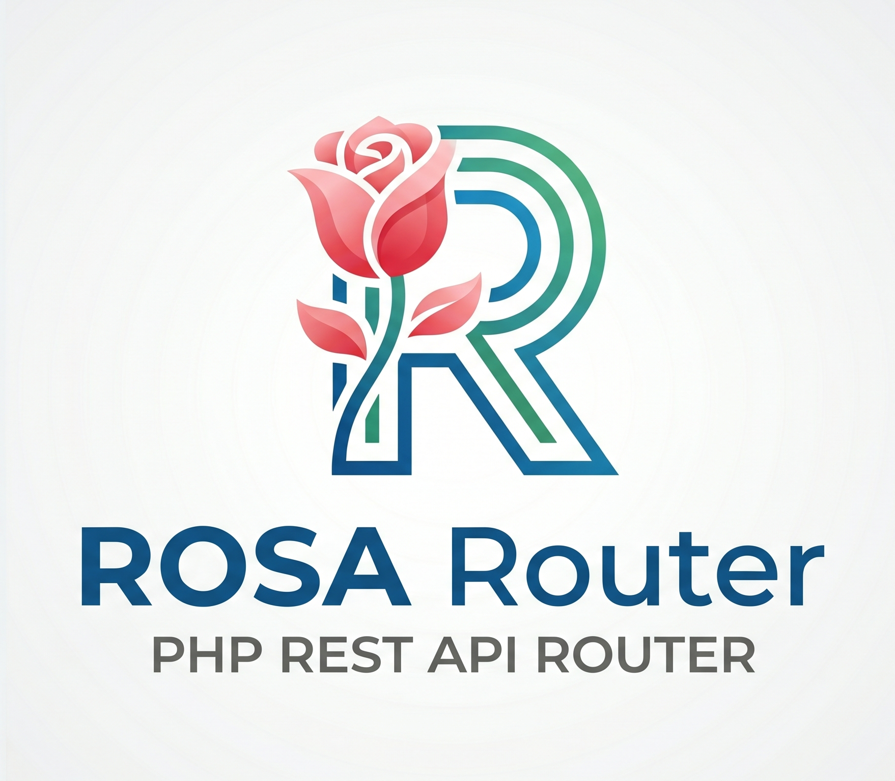

<p align="center">
  
</p>

<p align="center">
  <strong>A smart, lightweight and fast REST router for PHP.</strong>
</p>

<p align="center">
  <a href="https://github.com/rockberpro/rosa-router/actions/workflows/tests.yml"></a>
  <a href="https://packagist.org/packages/rockberpro/rosa-router"></a>
  <a href="https://www.php.net/"></a>
  <a href="LICENSE"></a>
  
</p>

---

## Table of Contents

- [Overview](#overview)
- [Why ROSA Router?](#why-rosa-router)
- [Features](#features)
- [Requirements](#requirements)
- [Installation](#installation)
- [Configuration](#configuration)
- [Quick Start](#quick-start)
- [Usage](#usage)
- [Authentication](#authentication)
- [Logging](#logging)
- [Testing](#testing)
- [License](#license)

## Overview

**ROSA Router** is a lightweight and efficient REST API engine built with PHP. It handles incoming HTTP requests and routes them to the appropriate controllers or actions based on your defined endpoints. With a focus on **simplicity** and **performance**, ROSA Router lets you build and deploy RESTful web services quickly — in both stateless and stateful (long-running server) modes.

## Why ROSA Router?

Most PHP routers force a choice up front: the classic **stateless** model — where
the framework boots from scratch on every request — or a **stateful**, long-running
server for lower latency. ROSA Router runs the _same_ route definitions in **both
modes**, so you can start simple on a shared host and later switch to a persistent
[ReactPHP](https://reactphp.org/) server by changing a single flag — no rewrite.

On top of that it stays **dependency-light and explicit**: a clean routing syntax,
first-class middleware, and **authentication built in** (JWT and API keys), without
pulling in a full framework.

## Features

- 🚀 **Easy routing** — Define routes for your REST API with a clean, expressive syntax.
- 🔀 **Full HTTP method support** — `GET`, `POST`, `PUT`, `PATCH` and `DELETE`.
- 🧩 **Route groups & prefixes** — Organize routes with prefixes, nesting and namespaces.
- 🛡️ **Middleware** — Attach middleware to single routes or whole groups.
- 🔐 **Built-in authentication** — JWT and API key strategies out of the box.
- 📝 **Request logging** — Opt-in per-route logging to file or database.
- ⚡ **Stateless or stateful** — Run on a classic web server or as a long-running ReactPHP server.
- 🪶 **Lightweight & fast** — Minimal overhead, optimized for performance.
- 🧯 **Built-in error handling** — Gracefully manage exceptions and invalid requests.

## Requirements

- PHP **8.0** or higher
- [Composer](https://getcomposer.org/)
- Extensions: `ext-json`, `ext-pdo`

## Installation

```bash
composer require rockberpro/rosa-router
```

## Configuration

ROSA Router is configured through environment variables loaded at bootstrap.
Copy the example file and adjust it for your environment:

```bash
cp .env.example .env
```

`Bootstrap::setup()` loads the configuration automatically. You can point it at a
custom path — both `.env` and `.ini` formats are supported:

```php
Bootstrap::setup();               // loads ./.env
Bootstrap::setup('config/.env');  // custom path
Bootstrap::setup('config/.ini');  // INI format
```

| Variable                                    | Description                                              | Example            |
| ------------------------------------------- | -------------------------------------------------------- | ------------------ |
| `API_NAME`                                  | Application name                                         | `rosa-api`         |
| `API_DEBUG`                                 | Verbose error output                                     | `false`            |
| `API_LOGS` / `API_LOGS_DB`                  | Request-log destination — file / database (see [Logging](#logging)) | `true` / `false`   |
| `API_ALLOW_ORIGIN`                          | CORS allowed origin                                      | `*`                |
| `API_SERVER_ADDRESS` / `API_SERVER_PORT`    | Address & port for stateful mode                         | `0.0.0.0` / `8081` |
| `API_AUTH_METHOD`                           | Authentication strategy — `JWT` or `KEY`                 | `JWT`              |
| `JWT_ISSUER` / `JWT_SUBJECT` / `JWT_SECRET` | JWT signing settings                                     | —                  |
| `API_DB_*`                                  | Database connection (host, port, user, pass, name, type) | `pgsql`            |

## How It Works

ROSA Router listens for HTTP requests and maps them to the correct route handler based on the request's method and URI. It supports both static and dynamic routes and is fully customizable to fit different project needs.

## Quick Start

### Stateless mode (web server)

```php
<?php
// index.php

use Rockberpro\RestRouter\Bootstrap;

require_once "vendor/autoload.php";

// Bootstrap::setup('path/to/.env');
// Bootstrap::setup('path/to/.ini');
Bootstrap::setup();

$server = Server::init();
if ($server->isApiEndpoint()) {
    $server->loadRoutes('./routes/api.php');
    $server->execute(Server::MODE_STATELESS);
}
```

### Stateful mode (long-running server)

```php
<?php
// server.php — run with: php server.php

use Rockberpro\RestRouter\Utils\DotEnv;
use Rockberpro\RestRouter\Bootstrap;
use React\Socket\SocketServer;
use React\Http\HttpServer;

require_once "vendor/autoload.php";

// Bootstrap::setup('path/to/.env');
// Bootstrap::setup('path/to/.ini');
Bootstrap::setup();

$port = DotEnv::get('API_SERVER_PORT');
$address = DotEnv::get('API_SERVER_ADDRESS');

$server = Server::init();
$server->loadRoutes('./routes/api.php');

$server = new HttpServer(
    $server->execute(Server::MODE_STATEFUL)
);
$server->on('error', function (Throwable $e) {
    print("Request error: " . $e->getMessage() . PHP_EOL);
});

$socket = new SocketServer("{$address}:{$port}");
$server->listen($socket);

print("Server running at http://{$address}:{$port}" . PHP_EOL);
```

## Usage

### Basic routes

A route maps an HTTP method and URI to a **handler**. The handler can be a
controller (`[Controller::class, 'method']` or `'Controller@method'`) or an
inline closure. Every handler must return a `Response`.

```php
use Rockberpro\RestRouter\Core\Route;

Route::get('/post/{post}/comment/{comment}', [PostController::class, 'get']);
Route::get('/user/{id}',                     [UserController::class, 'get']);
Route::post('/user',                         [UserController::class, 'post']);
Route::put('/user/{id}',                     [UserController::class, 'put']);
Route::patch('/user/{id}',                   [UserController::class, 'patch']);
Route::delete('/user/{id}',                  [UserController::class, 'delete']);
```

A handler can also be a closure that receives the `Request` and returns a `Response`:

```php
use Rockberpro\RestRouter\Core\Request;
use Rockberpro\RestRouter\Core\Response;
use Rockberpro\RestRouter\Core\Route;

Route::get('/ping', function (Request $request) {
    return new Response(['message' => 'pong'], Response::OK);
});
```

### Reading request data

Inside a handler, use the `Request` instance to read incoming values. `$request->get($key)`
resolves the key from body, path and query parameters (in that order):

```php
Route::get('/user/{id}', function (Request $request) {
    $id     = $request->get('id');        // path parameter  -> /user/42
    $fields = $request->get('fields');    // query parameter -> ?fields=name,email

    return new Response(['id' => $id, 'fields' => $fields], Response::OK);
});
```

Need them grouped by source? Use the dedicated accessors:

```php
$request->getPathParam('id');     // route placeholders, e.g. {id}
$request->getQueryParam('page');  // ?page=2
$request->getBodyParam('email');  // JSON body fields
$request->getParams();            // everything, grouped by source
```

### Responses

A `Response` takes a payload (sent as JSON) and an HTTP status code. The `Response`
class exposes constants for the common codes:

```php
return new Response(['message' => 'Created'], Response::CREATED);       // 201
return new Response(['message' => 'Not found'], Response::NOT_FOUND);   // 404
return new Response(['message' => 'Invalid'], Response::UNPROCESSABLE_ENTITY); // 422
```

### Grouped routes

Use `prefix()` + `group()` to share a common URI segment across several routes
instead of repeating it on each one:

```php
Route::prefix('v1')->group(function() {
    Route::get('/users/{id}', [UserController::class, 'get']);  // GET  /api/v1/users/{id}
    Route::post('/users', [UserController::class, 'post']);     // POST /api/v1/users
});
```

A group is also where you attach a `middleware()` or `namespace()` once and have
it apply to every route inside (see the [Middleware](#middleware) and
[Namespaces](#namespaces) sections).

### Nested routes

Groups can be nested to any depth. Each nested `prefix()` is appended to its
parent, so the final URI is the concatenation of every prefix in the chain.
All routes are served under the framework's `/api` base path:

```php
Route::prefix('v1')->group(function() {

    Route::get('/users/{id}', [UserController::class, 'get']);   // GET  /api/v1/users/{id}
    Route::post('/users', [UserController::class, 'post']);      // POST /api/v1/users

    Route::prefix('users/{user}')->group(function() {
        Route::get('/posts', [PostController::class, 'index']);  // GET  /api/v1/users/{user}/posts
        Route::post('/posts', [PostController::class, 'store']); // POST /api/v1/users/{user}/posts
    });
});
```

### Namespaces

Set a `namespace()` so you can reference controllers by their short
`Controller@method` string instead of the fully-qualified class name:

```php
Route::namespace('App\\Controllers')->group(function() {
    Route::get('/example', 'ExampleController@get');
    Route::post('/example', 'ExampleController@post');
});
```

`namespace()` composes with the other modifiers — combine it with `prefix()`
and `middleware()` on the same group when you need to:

```php
Route::prefix('v1')
    ->namespace('App\\Controllers')
    ->middleware(AuthMiddleware::class)
    ->group(function() {
        Route::get('/example', 'ExampleController@get');
    });
```

### Middleware

A middleware implements `MiddlewareInterface`. Its `handle()` method receives the
`Request` and a `$next` closure — call `$next($request)` to pass control along,
or return a `Response` early to short-circuit the request:

```php
namespace App\Middleware;

use Closure;
use Rockberpro\RestRouter\Middleware\MiddlewareInterface;
use Rockberpro\RestRouter\Core\Request;
use Rockberpro\RestRouter\Core\Response;

class AuthMiddleware implements MiddlewareInterface
{
    public function handle(Request $request, Closure $next): Response
    {
        if (!$request->get('token')) {
            return new Response(['message' => 'Access denied'], Response::UNAUTHORIZED);
        }

        return $next($request);
    }
}
```

Attach it to a single route or to a whole group:

```php
// Single route
Route::middleware(AuthMiddleware::class)
    ->get('/hello', 'HelloWorldController@hello');

// Whole group
Route::prefix('v1')
    ->middleware(AuthMiddleware::class)
    ->namespace('App\\Controllers')
    ->group(function() {
        Route::get('/hello', 'HelloWorldController@hello');
    });
```

**Middleware accumulates through nesting.** When groups are nested, a route
runs *every* middleware declared along its chain — an inner group does not
discard the middleware inherited from an outer one. They execute **outer-most
first**, and the same middleware declared at multiple levels runs only once:

```php
Route::middleware(LogRequestMiddleware::class)   // applies to everything below
    ->group(function() {

        Route::get('/health', 'HealthController@check');   // [Log]

        Route::middleware(AuthMiddleware::class)
            ->group(function() {
                // runs [Log, Auth] — logging is NOT lost by the inner group
                Route::get('/user/{id}', 'UserController@get');
            });
    });
```

This makes a single outer group a practical way to apply a cross-cutting
middleware (like request logging) to every route it wraps.

### Logging

ROSA Router ships with a `LogRequestMiddleware` that records each incoming
request (endpoint, method, params, remote address, user agent). Logging works in
two independent layers:

1. **Trigger — bind the middleware.** Like any middleware, it only runs on routes
   you attach it to. Logging is **opt-in**, never automatic:

   ```php
   use Rockberpro\RestRouter\Middleware\LogRequestMiddleware;

   Route::prefix('v1')
       ->middleware(LogRequestMiddleware::class)
       ->group(function() {
           Route::get('/hello', 'HelloWorldController@hello');
       });
   ```

   Because [middleware accumulates through nesting](#middleware), wrapping all
   your routes in one outer group is the simplest way to log everything —
   inner groups can still add their own middleware (e.g. auth) without losing
   the logging:

   ```php
   Route::middleware(LogRequestMiddleware::class)->group(function() {
       require 'routes/api.php'; // every route inside is logged
   });
   ```

2. **Destination — pick where logs go** via env (see [Configuration](#configuration)):
   - `API_LOGS=true` — write to the info log file (`logs/info.log`).
   - `API_LOGS_DB=true` — write to the `logs` database table.

   You can enable either, both, or combine the middleware with others:

   ```php
   Route::middleware([AuthMiddleware::class, LogRequestMiddleware::class])
       ->get('/user/{id}', [UserController::class, 'get']);
   ```

**No silent failures.** If you bind `LogRequestMiddleware` to a route but leave
**both** `API_LOGS` and `API_LOGS_DB` disabled, the request has nowhere to be
logged — a contradiction — and the router throws a `LogHandlerException` instead
of quietly dropping the log. Either enable a destination, or remove the
middleware from that route. A missing/undefined env variable likewise throws,
so misconfiguration always surfaces loudly.

### Controllers

A controller extends the base `Controller` class. Each action receives the
`Request` and returns a `Response` — use the `response()` helper as a shortcut:

```php
namespace App\Controllers;

use Rockberpro\RestRouter\Controllers\Controller;
use Rockberpro\RestRouter\Core\Request;
use Rockberpro\RestRouter\Core\Response;

class UserController extends Controller
{
    public function get(Request $request): Response
    {
        $id = $request->get('id');

        // ... fetch the user from your data source

        if (!$id) {
            return $this->response(['message' => 'User not found'], Response::NOT_FOUND);
        }

        return $this->response(['id' => $id, 'name' => 'Jane Doe'], Response::OK);
    }
}
```

Bind it to a route by class + method, or group several actions under the same controller:

```php
// Explicit method binding
Route::get('/user/{id}', [UserController::class, 'get']);

// Group actions under one controller
Route::controller(UserController::class)->group(function() {
    Route::get('/user/{id}', 'get');
    Route::post('/user', 'post');
});
```

## Authentication

ROSA Router ships with authentication built in — no extra package required.
Pick the strategy with `API_AUTH_METHOD` in your `.env`:

- **`JWT`** — stateless JSON Web Tokens, signed with your `JWT_SECRET`.
- **`KEY`** — API keys validated against the database.

Protect any route or group with the bundled `AuthMiddleware`:

```php
use Rockberpro\RestRouter\Middleware\AuthMiddleware;

Route::prefix('v1')
    ->middleware(AuthMiddleware::class)
    ->group(function() {
        Route::get('/me', [UserController::class, 'me']); // requires a valid token / key
    });
```

When using JWT, the built-in endpoints issue and refresh tokens:

| Method & route           | Description                                           |
| ------------------------ | ----------------------------------------------------- |
| `POST /api/auth/refresh` | Exchange credentials for an access + refresh token    |
| `POST /api/auth/access`  | Exchange a valid refresh token for a new access token |

Send the token on protected requests via the `Authorization: Bearer <token>` header.

## Testing

The test suite runs on [PHPUnit](https://phpunit.de/):

```bash
composer install
vendor/bin/phpunit tests
```

## License

ROSA Router is open-source software licensed under the [MIT License](LICENSE).

---

<p align="center">
  Made with ❤️ by <a href="https://github.com/rockberpro">rockberpro</a>
</p>
